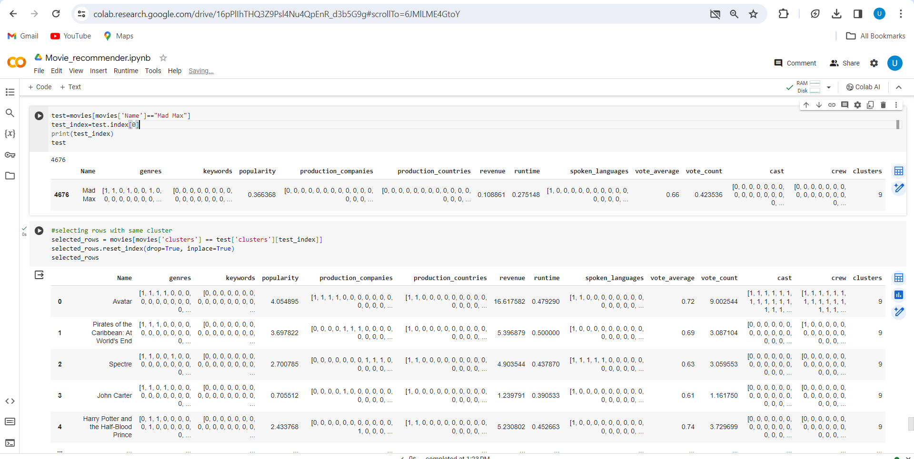
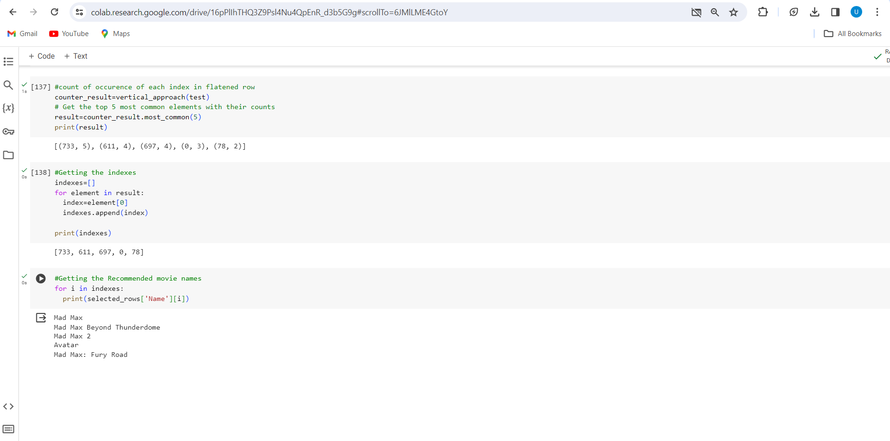
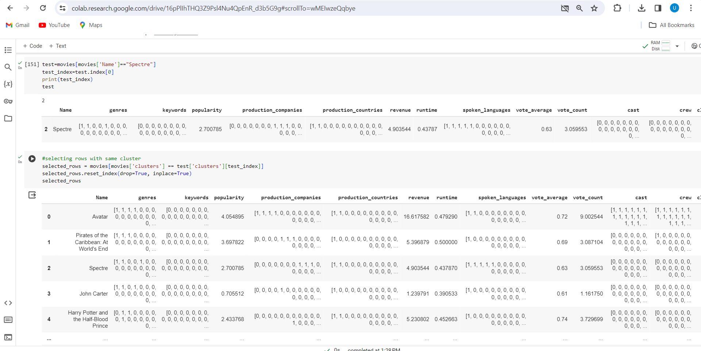
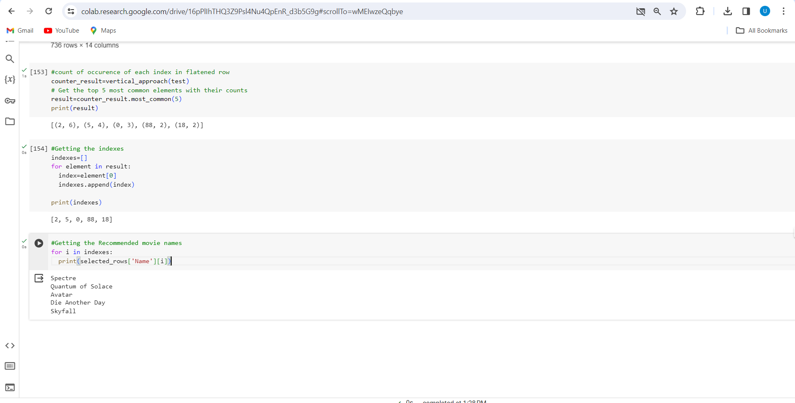

# Movie Recommendation System
A content Based Movie recommendation system was implemented using the TMDB 5000 dataset

### Following is the base approach behind the result
1. **Horizontal Clustering**
- A clustering algorithm is applied on the dataset to classify each and every movie instance in a specific cluster. During testing, the cluster of the 'test movie' is determined and all the movies that belong to the same cluster are extracted. 
2. **Vertical Analysis**
- For each and every column for the obtained set of movies, since every entry in the column consists of the encoding for a specific movie, the similarity of that encoding with the encoding of the test movie in the same column was found, and then after analysis top five most similar movies index were obtained based on those similarity values (from each column). So a set of top 5 movies is generated for every column
- Now we check every set of 'Top 5 movies' generated from every column and get the movie that has occurred in the maximum number of sets.
Similarly, more topmost repeating movies are determined and then Printed.

To summarize : 
**It involves identifying all the movies that belong to the same cluster with the given test movie, then generating a set of most similar movies for each attribute using similarity scores, and then determining the movie that has occurred in the maximum of the generated sets.**

### The benefit of the approach is 
- If the system is to be integrated with an actual application that involves managing user profiles then for each user profile determining a single preference would be easier with the binary encoded column - "genres, keywords, production_companies,	production_countries, spoken_languages, cast, crew" where each position in the the binary encoding indicate a specific presence of a value.
-To determine the common preference we can simply perform the 'OR' operation for each binary encoded column and then move ahead with the base approach.

### Following are the steps which were implemented 
1.	*Data Loading*
- Importing the data and necessary libraries
2.	*Data Visualization* : 
-	Determining the column names and keeping only the necessary columns
- Finding the null places and filling them with mean.
3.	*Data Encoding*
- Converting columns into two types: Numerical, binary lists
4.	*Training*
- Applying Clustering Algorithm
5.	*Testing*
- Implementing the base approach and testing it for a random movie

**Following is the video link(linkedin post)**: https://www.linkedin.com/posts/urmil-pawar-024662252_codesoft-movierecommendationsystem-activity-7149339296926277632-GYvw?utm_source=share&utm_medium=member_desktop

### Following are the images
**Movie Name : Mad-Max**

**Movie Name : Spectre**

